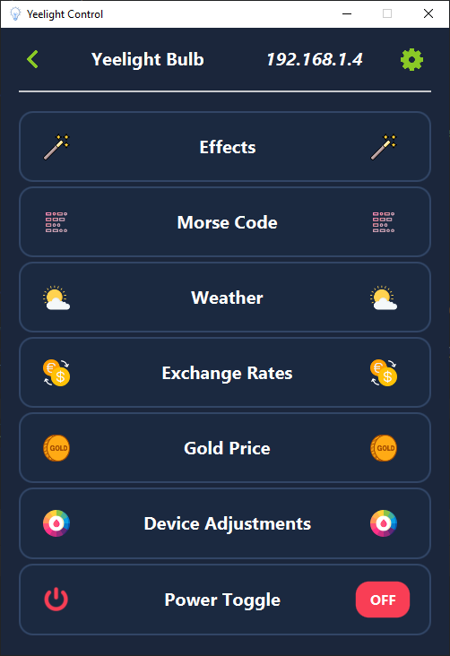

# YeelightControl
Yeelight Control is an application written in Java that allows you to control a smart Yeelight Bulb that is connected to your Wi-Fi network.

## Description
The application uses my API which allows you to connect to the device, manipulate its behavior and listen to responses from the device.

The application has many functionalities such as:
* change of colors, brightness and color temperature
* translate the text entered by the user into morse code and then display it using a light bulb
* setting the bulb in night mode, reading mode, etc
* change of bulb parameters based on the weather
* change of bulb parameters based on the exchange rate
* change of bulb parameters based on gold price

### App screenshots

